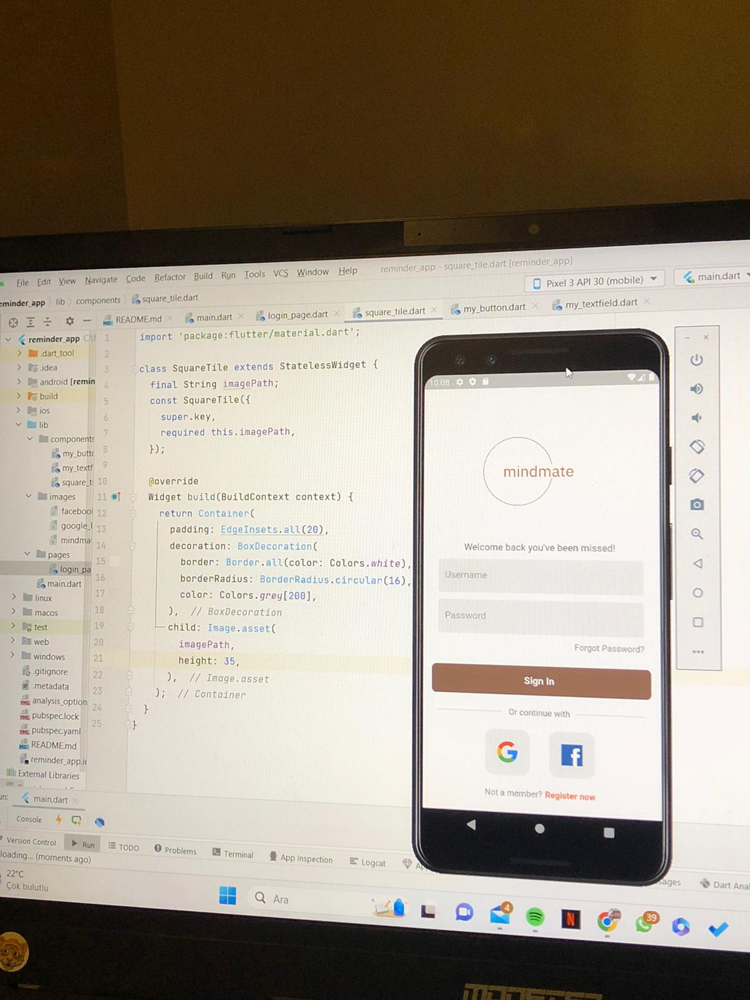

# F111---Mindmate
Takım Flutter 111

# **Takım İsmi**

Takım Flutter 111

# Ürün İle İlgili Bilgiler

## Takım Elemanları
- Miray Topal: Scrum Master 
- Tarık Çakmak: Product Owner
- Begüm Ekmekçi: Developer
- İrem Tokuş: Developer
- Utku Yunus Zırhlı: Developer

## Ürün İsmi

--Mindmate--

## Product Backlog URL

[Flutter Team 111 Miro Backlog Board] https://miro.com/app/board/uXjVM9yQl6E=/?share_link_id=830847172577

## Ürün Açıklaması

Mindmate uygulaması bireylerin olumlu alışkanlıklar geliştirmelerine ve yaşamlarını dönüştürmelerine yardımcı olmak için tasarlanmıştır. Mindmate kullanıcılara sağlıklı rutinler geliştirme ve sürdürme, kötü alışkanlıkları yenme ve kişisel gelişim sağlama konusunda güç veren kapsamlı ve kullanıcı dostu bir uygulamadır. Mindmate alışkanlık geliştirmeye kişiselleştirilmiş bir yaklaşım getirerek her kullanıcının alışkanlık geliştirme yolculuğunun kendine özgü ihtiyaç ve isteklerine göre uyarlanmasını sağlar. İster daha fazla egzersiz yapmak, ister daha fazla okumak, daha fazla meditasyon yapmak veya sigarayı bırakmak isteyin, Mindmate ilerlemenizi izlemenize ve hedeflerinize bağlı kalmanız için sizi motive etmenize yardımcı olur. 

- **Uygulama birincil fonksiyonu**: Uygulamanın ilk işlevi hedef belirlemedir. Kullanıcılar net hedefler belirleyerek alışkanlık geliştirme yolculukları için bir temel oluşturur ve başarı için bir yol haritası oluşturur. Mindmate alışkanlıklarınızı özelleştirmenize, hatırlatıcılar ayarlamanıza olanak tanır. Kullanıcılar net hedefler ve amaçlar belirleyerek alışkanlık geliştirme yolculukları için bir temel ve başarılı bir yol haritası oluşturur.

- **Uygulama ikincil fonksiyonu**: Uygulamanın ikinci işlevi alışkanlık takibidir. Mindmate, kullanıcıların ilerlemelerini zahmetsizce izlemelerine olanak tanıyan kusursuz bir alışkanlık izleme sistemi sunar. Kullanıcılar tamamlanan görevleri kolayca kaydedebilir ve istedikleri alışkanlıkları uygulamadaki tutarlılıklarını izleyebilirler. Uygulama, kullanıcıların takipte kalmalarına yardımcı olmak için özelleştirilebilir hatırlatıcılar sağlar ve onları alışkanlıklarıyla tutarlı bir şekilde ilgilenmeye teşvik eder.

## Ürün Özellikleri

- Kullanıcıların net ve spesifik hedefler belirlemesi.
- Kullanıcıların kolay bir şekilde alışkanlık takibi yapabilmesi.
- Kişiselleştirilebilen hedefler ve hatırlatıcılar.

## Hedef Kitle

- Kendilerini geliştirmek isteyen bireyler
- Hedef odaklı bireyler
- İş hayatındaki meşgul bireyler
- Öğrenciler veya yeni bir şey öğrenmek isteyenler
- Disiplin ve destek arayan bireyler

## Juriye Not

---

---

# Sprint 1

- **Sprint Notları**: 

- **Sprint içinde tamamlanması tahmin edilen puan**: 90 Puan

- **Puan tamamlama mantığı**: Toplamda proje boyunca tamamlanması gereken 340 puanlık backlog bulunmaktadır. 3 sprint'e bölündüğünde ilk sprint'in en azından 90 ile başlaması gerektiğine karar verildi.

- **Daily Scrum**: Daily Scrum toplantılarımızı haftalık şekilde Google Meet üzerinden gerçekleştirdik. Zamansal sebeplerden ötürü ise her yeni fikir veya güncelleştirmemizde Whatsapp üzerinden iletişim kurmaya karar verdik. Daily Scrum toplantısı örneği png/ word/ google docs olarak Readme'de tarafımızdan paylaşılmaktadır: https://docs.google.com/document/d/1Fqg8Y7ptVcQRVHXD9Ws-xS-VoL2O1KVpZ_eB2tPGrFw/edit?usp=sharing 
- https://github.com/miraytopal123/F111---Mindmate/blob/1658d68b0c69e30f56eade0084c325c5b405dc77/Project_Management/daily%20scrum%20yaz%C4%B1%C5%9Fmalar%C4%B1%20sprint%201%20.docx

- **Sprint board update**: Sprint board screenshotları: 
![Backlog 1]: https://github.com/miraytopal123/F111---Mindmate/blob/84cbf4dfbb386713b903ed2be70788d82b64b6b3/Project_Management/1.%20Sprint/sprint%20board1_.png

- **Ürün Durumu**: Ekran görüntüleri:
  ![Screenshot 1]: https://github.com/miraytopal123/F111---Mindmate/blob/84cbf4dfbb386713b903ed2be70788d82b64b6b3/Project_Management/1.%20Sprint/%C3%BCr%C3%BCn%20durumu%20sprint%201.jpeg
  ![Screenshot 2]: https://github.com/miraytopal123/F111---Mindmate/blob/84cbf4dfbb386713b903ed2be70788d82b64b6b3/Project_Management/1.%20Sprint/%C3%BCr%C3%BCn2.png
  ![Screenshot 3]: https://github.com/miraytopal123/F111---Mindmate/blob/84cbf4dfbb386713b903ed2be70788d82b64b6b3/Project_Management/1.%20Sprint/%C3%BCr%C3%BCn3.png
  ![Screenshot 4]: https://github.com/miraytopal123/F111---Mindmate/blob/84cbf4dfbb386713b903ed2be70788d82b64b6b3/Project_Management/1.%20Sprint/%C3%BCr%C3%BCn4.png
  ![Screenshot 5]: https://github.com/miraytopal123/F111---Mindmate/blob/84cbf4dfbb386713b903ed2be70788d82b64b6b3/Project_Management/1.%20Sprint/sprint%20board1_.png
  
  
- **Sprint Review**: 
Alınan kararlar: Login ekranı oluşturulmuştur.

- **Sprint Retrospective:**
  - Google Meet üzerinden yapılan toplantılarda ekip tanışıp kaynaşmış, ürün fikri ve yol haritası belirlenmiştir.
  - Roller belirlenmiş ve gereklilikleri yerine getirilmştir.
  - Takım içindeki görev dağılımıyla ilgili düzenlemeye gidilmiştir.
 

---

## Product Backlog URL

[Flutter Team 52 Miro Backlog Board] https://miro.com/app/board/uXjVM9yQl6E=/?share_link_id=830847172577

---
